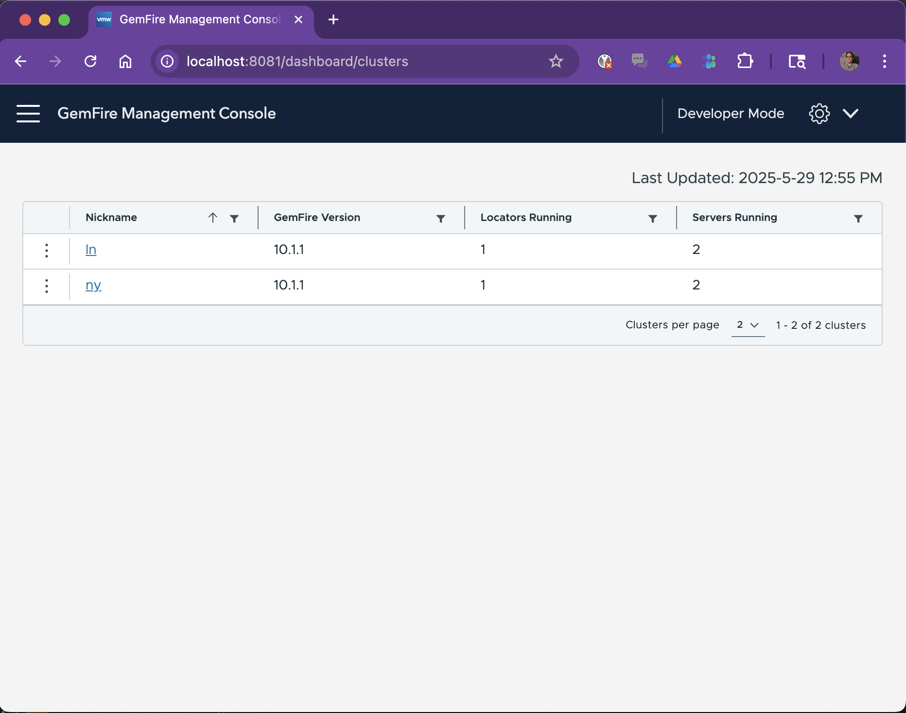

# Manual GemFire Kubernetes example

## First Steps
1. Download helm charts for the version of gemfire you want to deploy 
    - ./<somedirectory>/gemfire-crd-x.x.x.tgz
    - ./<somedirectory>/gemfire-operator-X.4.0.tgz
2. Setup a Kubernetes environment below(Minikube, Kind, GCP) 
    - You need at least 16 Gig of memory allocated

## Get an Access Token for Broadcom Registry
1. Login to https://support.broadcom.com/ and select My Downloads
2. Search by Product Name = VMware Tanzu GemFire
3. Click on VMware Tanzu GemFire
4. Scroll down, Show All Releases, scroll down to Click Green Token for Repository Access and click on the green symbol to the far right.
5. Note your email address.  
6. Copy your access_token (not including any surrounding quotation marks)
### Optional (Test the token)
1. docker login registry.packages.broadcom.com
2. Enter the email address shown as the username and access token as the password.
3.  docker run -it -e ACCEPT_TERMS=y registry.packages.broadcom.com/pivotal-gemfire/vmware-gemfire:10.0.5 gfsh


## Make sure that cert manager is installed
1. Check if it is by running 
```
kubectl get deployments.apps -A | grep cert
```
2. If nothing is found, add helm chart
```
helm repo add jetstack https://charts.jetstack.io --force-update
```
1. install cert manager
```
 helm install cert-manager jetstack/cert-manager --namespace cert-manager --create-namespace --version v1.6.3 --set installCRDs=true  
```

## 
1. Create namespaces for the simulated US and UK clusters and the operator
```bash
    kubectl create ns us
    kubectl create ns uk
    kubectl create ns gemfire-operator
```
2. Create secrets to pull the image in the above name spaces 
```bash
kubectl create secret docker-registry image-pull-secret --namespace="NAMESPACE-NAME" --docker-server=registry.packages.broadcom.com --docker-username='USERNAME' --docker-password='PASSWD'
```
3.  Install the gemfire operators and crd from step 1
```bash
cd <somedirectory>
helm install gemfire-crd ./gemfire-crd-x.x.x.tgz --version <version> --namespace gemfire-operator --set operatorReleaseName=gemfire-operator
helm install gemfire-operator ./gemfire-operator-X.4.0.tgz --version <version> --namespace gemfire-operator
```
4.  Run the following manifest to create the New York cluster:
```yaml
apiVersion: gemfire.vmware.com/v1
kind: GemFireCluster
metadata:
  name: ny
  namespace: us
spec:
  security:
    tls: {} 
  image: registry.packages.broadcom.com/pivotal-gemfire/vmware-gemfire:10.1.1
  imagePullSecrets:
    - name: image-pull-secret
  locators:
    overrides:
      jvmOptions: ["-Duser.timezone=America/New_York"]
      gemFireProperties:
        - name: "distributed-system-id"
          value: "2"
        - name: "remote-locators"
          value: "ln-locator-0.uk.svc.cluster.local[10334]"
  servers:
    overrides:
      jvmOptions: ["-Duser.timezone=America/New_York"]
      gemFireProperties:
        - name: "start-dev-rest-api"
          value: "true"
```

**** At this point you will have a running cluster. If you want to show Wan Connectivity continue on. ****
   
1. Run the following manifest to create the London cluster:
```yaml
apiVersion: gemfire.vmware.com/v1
kind: GemFireCluster
metadata:
  name: ln
  namespace: uk
spec:
  security:
    tls: {}  
  image: registry.packages.broadcom.com/pivotal-gemfire/vmware-gemfire:10.1.1
  imagePullSecrets:
    - name: image-pull-secret
  locators:
    overrides:
      jvmOptions: ["-Duser.timezone=Europe/London"]
      gemFireProperties:
        - name: "distributed-system-id"
          value: "1"
        - name: "remote-locators"
          value: "ny-locator-0.us.svc.cluster.local[10334]"
    libraries:
      - name: gemfire-vectordb
        container:
          image: localhost:5001/gemfire-vector:1.2.0  
          path: "/gemfire-vectordb-gfm/*.gfm"          
  servers:
    overrides:
      gemFireProperties:
        - name: "start-dev-rest-api"
          value: "true"
    libraries:
      - name: gemfire-vectordb
        container:
          image: localhost:5001/gemfire-vector:1.2.0  
          path: "/gemfire-vectordb-gfm/*.gfm"         
          
```
6. Make sure that the clusters are up:
```bash
  kubectl get gemfireclusters.gemfire.vmware.com -A 
```
  - You should see locators at 1/1 and servers at 2/2:
```
NAMESPACE   NAME   LOCATORS   SERVERS   CLUSTER IMAGE                                                          OPERATOR VERSION
uk          ln     1/1        2/2       registry.packages.broadcom.com/pivotal-gemfire/vmware-gemfire:10.1.1   2.4.0-build.32
us          ny     1/1        2/2       registry.packages.broadcom.com/pivotal-gemfire/vmware-gemfire:10.1.1   2.4.0-build.32
  ```
7.  Set up region and wan connectivity with this Job: 
```yaml
apiVersion: batch/v1
kind: Job
metadata:
  name: gfsh-job
spec:
  template:
    spec:
      initContainers:
        - name: init-uk
          image: registry.packages.broadcom.com/pivotal-gemfire/vmware-gemfire:10.1.1
          command: ['sh', '-c']
          args:
            - "until gfsh -e 'connect --locator=ln-locator-0.uk.svc.cluster.local[10334]'; do printf '#'; sleep 10; done"
        - name: init-us
          image: registry.packages.broadcom.com/pivotal-gemfire/vmware-gemfire:10.1.1
          command: ['sh', '-c']
          args:
            - "until gfsh -e 'connect --locator=ny-locator-0.us.svc.cluster.local[10334]'; do printf '#'; sleep 10; done"
      containers:
        - name: london
          image: registry.packages.broadcom.com/pivotal-gemfire/vmware-gemfire:10.1.1
          env:
            - name: ACCEPT_TERMS
              value: "y"
          command:
            - gfsh
            - "-e connect --locator=ln-locator-0.uk.svc.cluster.local[10334]"
          args:
            - "-e create gateway-receiver"
            - "-e configure pdx --read-serialized=true --disk-store"
            - "-e create gateway-sender --id='ny' --parallel='false' --remote-distributed-system-id='2'"
            - "-e create region --name=sample-region --type=REPLICATE --gateway-sender-id='ny'"
        - name: newyork
          image: registry.packages.broadcom.com/pivotal-gemfire/vmware-gemfire:10.1.1
          env:
            - name: ACCEPT_TERMS
              value: "y"
          command:
            - gfsh
            - "-e connect --locator=ny-locator-0.us.svc.cluster.local[10334]"
          args:
            - "-e create gateway-receiver"
            - "-e configure pdx --read-serialized=true --disk-store"
            - "-e create gateway-sender --id='ln' --parallel='false' --remote-distributed-system-id='1'"
            - "-e create region --name=sample-region --type=REPLICATE --gateway-sender-id='ln'"
      restartPolicy: Never
```
8. Connect to the cluster using gsfh:
```bash
kubectl exec -n uk ln-server-0 -it -- gfsh  
```
9. Setup Gemfire Management Console using the following manifest:
```yaml
--- 
apiVersion: apps/v1
kind: Deployment
metadata:
  labels:
    app: gemfire-management-console
  name: gemfire-management-console
  namespace: gemfire-operator
spec:
  replicas: 1
  selector:
    matchLabels:
      app: gemfire-management-console
  template:
    metadata:
      labels:
        app: gemfire-management-console
    spec:
      containers:
      - image: registry.packages.broadcom.com/gemfire-management-console/gemfire-management-console:1.3.0
        name: gemfire-management-console
        ports:
        - containerPort: 443
          name: https
        - containerPort: 8080
          name: http
      imagePullSecrets:
        - name: image-pull-secret
      dnsPolicy: ClusterFirst
---
apiVersion: v1
kind: Service
metadata:
  labels:
    app: gemfire-management-console
  name: gemfire-management-console
  namespace: gemfire-operator
spec:
  ports:
  - port: 8080
    protocol: TCP
    targetPort: 8080
  selector:
    app: gemfire-management-console
```
10. Connect to the Gemfire Management Console by proxy:
```bash
kubectl port-forward -n gemfire-operator services/gemfire-management-console 8081:8080 
```
11. Open in a browser and enable developer mode:

12. Select "Import Connections"

13. Create this JSON file and import it into the managemnt console:
```json
[
  {
    "connectionNumber": 1,
    "clusterNickname": "ln",
    "clusterHost": "ln-locator-0.uk.svc.cluster.local",
    "clusterPort": 7070,
    "clusterSecurityType": "None"
  },
  {
    "connectionNumber": 2,
    "clusterNickname": "ny",
    "clusterHost": "ny-locator-0.us.svc.cluster.local",
    "clusterPort": 7070,
    "clusterSecurityType": "None"
  }
]
```
13. You can now explore the clusters:
 